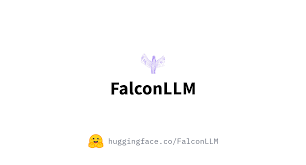

# Beyond the Anti-Jam: LLM for Zero Touch Networks

[](https://github.com/yourusername/yourrepository/issues)

   

This project explores the integration of Large Language Models (LLMs) with Deep Reinforcement Learning (DRL) to enhance the transparency and interpretability of anti-jamming strategies in Zero Touch Networks (ZTNs). The goal is to provide human-readable explanations for DRL-based decisions, making complex strategies intuitive for network administrators. The project leverages LLMs to generate natural language descriptions for DRL actions based on observed state vectors and rewards.

## Getting Started

Follow these instructions to set up and run the project on your local machine for development and testing.

### Prerequisites

- Python 3.7 or higher
- PyTorch
- OpenAI Gym
- Matplotlib
- Numpy
- Pandas
- StreamLit

For specific library versions, please refer to the `requirements.txt` file.

### Installation

1. Clone the repository to your local machine.
2. Install the required packages using pip:

   ```bash
   pip install -r requirements.txt

   ```
3. Execute the script:

   ```bash
   python3 appy.py
   ```

### Usage

The primary script trains different DQN agent variants for a specified number of episodes. After training, the agent's performance is evaluated and plotted. Relevant data, such as agent behavior, rewards, throughput, and channel switching times, are saved for further analysis.

#### Repository Structure

The structure of the repository is designed to maintain clarity and organization:

- **agents**: This directory contains various agent implementations, categorized into different types such as actor-critic, DQN, policy gradient, and stochastic policy search agents.

- **environments**: The directory houses the implementation of the RFSpectrum environment, where the agent operates and learns.

- **results**: This directory stores the data and graphs generated during training and evaluation. The `Anti_Jam.py` script is the main entry point for running the training and evaluation process.

- **tests**: This directory can be used to write and execute tests for the codebase.

- **utilities**: The directory contains utility files, including data structures and visual assets.

#### License

This project is licensed under the MIT License - see the LICENSE.md file for details.

#### Acknowledgements

This project is supported by the following:

- [Deep Reinforcement Learning Algorithms with PyTorch](https://github.com/p-christ/Deep-Reinforcement-Learning-Algorithms-with-PyTorch): This repository provides PyTorch implementations of deep reinforcement learning algorithms and environments.

- **Research Paper**: The implementation is based on the research paper titled "Beyond the Anti-Jam: Unraveling DRL-based Anti-Jamming Strategy in Zero Touch Networks through Large Language Models". The paper serves as the theoretical foundation for the project and can be accessed [here](https://arxiv.org/abs/2307.06796).

- **Hugging Face Transformers Library**: This repository provides tools for integrating and fine-tuning large language models, enabling natural language understanding and generation.

#### Contributing

Contributions to this project are welcome! If you'd like to contribute, please follow these steps:

1. Fork the repository.
2. Create a new branch for your feature/fix.
3. Make your changes and commit them with clear messages.
4. Push your changes to your forked repository.
5. Submit a pull request, detailing the changes you made and why they should be merged.

Let's work together to improve this project and make it even more effective in countering jamming attacks!
